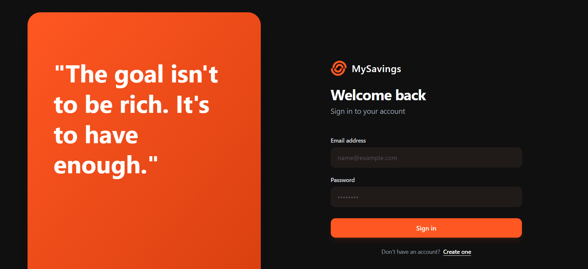
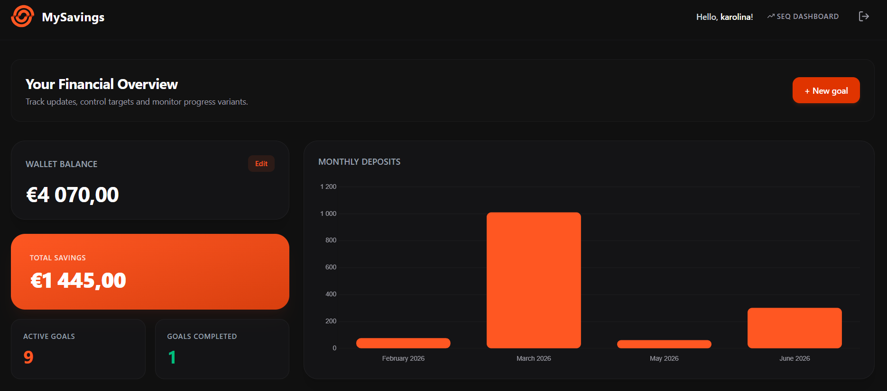
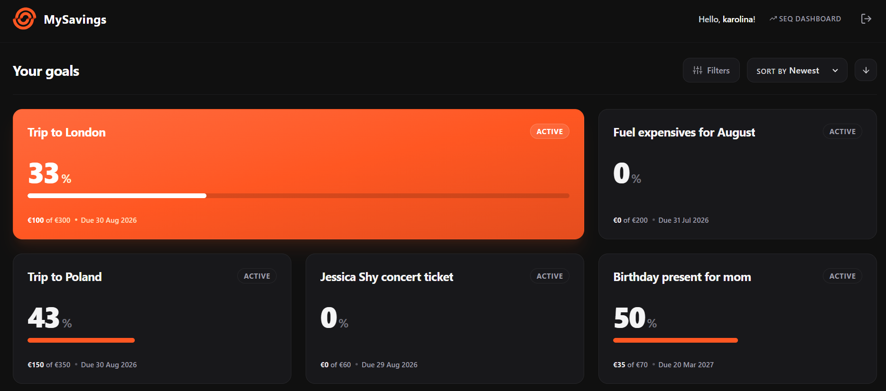
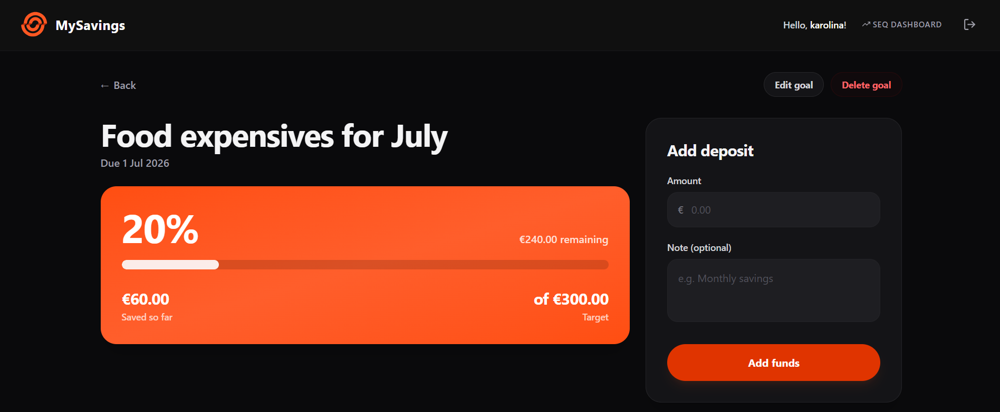
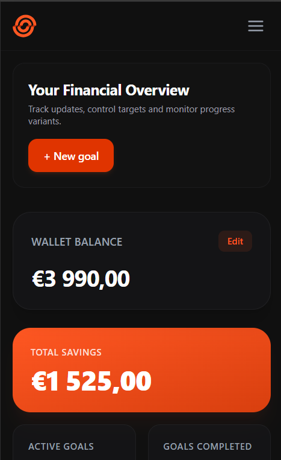

# MySavings — Personal Budget & Savings Tracker

> A full-stack web app for tracking income, expenses, and savings goals — built as part of a team capstone project, with this fork focused on my own continued development and improvements.

**Status:** Work in progress (v0.1) · **Branch to review:** `dev` (not `main`)

## About the project

MySavings helps users manage their personal finances by tracking income and expenses and setting savings goals. Users can allocate money to different categories, log expenses against a planned budget, and see their overall balance and progress in real time through charts and progress cards.

This started as a team capstone project. This fork is where I continue developing and refining it independently — see the [My contribution](#my-contribution) section below for what's specifically mine.

## Screenshots






## Features

**Implemented**
- User registration and login/logout (email + password)
- Add, edit, and delete a savings amount, with portions allocated toward specific goals
- Create, edit, and delete savings goals, each with:
  - Name, target amount, target date and allocated amount
- Savings dashboard: monthly summaries with charts, total amount allocated to goals, goals completed vs. remaining, and per-goal progress cards (amount saved, time left)
- Filter goals by status, date, or name; sort by most recent, deadline, progress, amount saved, or alphabetically
- Event log (backend) recording actions with timestamp and related data
- Automated backend unit tests

**Planned / not yet implemented**
- Admin role: manage users and expense categories, view the full event log (by user/action)
- Income entry as a standalone amount, to calculate how much of it can realistically go to savings

## Tech stack

| Layer | Technology |
|---|---|
| Backend | C#, .NET 10 |
| Frontend | React 19 |
| Database | MySQL |
| Logging | Serilog + Seq |
| Auth | JWT |
| Testing | xUnit (`dotnet test`) |

## My contribution

I worked across the full stack on this project — frontend, backend, and database design.

Frontend — my strongest area, and where I took primary ownership of code quality overall. Beyond building out core features, I led the final styling pass to match the Figma designs and implemented accessibility (a11y) improvements.

Backend — contributed significantly to authentication and authorization, and built out entities along with their related layers (repositories, services, etc.).

Database — designed the initial database schema at the start of the project. This gave the whole team a clear picture of how data flows through the app and where it could be extended later on.

Working on this project touched nearly every skill I've learned so far, end to end — which made it both challenging and one of the most rewarding parts of the course.

## Getting started

### Prerequisites
- [.NET 10 SDK](https://dotnet.microsoft.com/en-us/download)
- Node.js + npm
- Docker (for MySQL and Seq)

### 1. Install frontend dependencies
Run from `./frontend/`:
```bash
npm install
```

### 2. Start the database (Docker)
```bash
docker run --name MySavings -e MYSQL_ROOT_PASSWORD=root -d -p 3306:3306 mysql:lts
```

### 3. Apply database migrations
Run from the project root:
```bash
dotnet ef database update
```

### 4. Start the API
Run from `./backend/MySavings.API/`:
```bash
dotnet run
```

### 5. Start the frontend
Run from `./frontend/`:
```bash
npm run dev
```

### 6. (Optional) Start Seq for logging
```bash
docker run -d --name seq -p 5341:5341 -p 8081:80 -e ACCEPT_EULA=Y -e SEQ_FIRSTRUN_NOAUTHENTICATION=True datalust/seq:latest
```
Logs are then viewable at [http://localhost:8081](http://localhost:8081).

## Database migrations

Create a new migration (run from project root):
```bash
dotnet ef migrations add UpdateUserTable -p ./backend/MySavings.Data/ -s ./backend/MySavings.API/
```

## Running tests

Run from `./backend/MySavings.Services.Tests/`:
```bash
dotnet test
```

## Useful links
- [JWT debugger](https://jwt.io) — inspect JWT tokens
- Seq (local logging UI): http://localhost:8081

## Non-functional notes
- All actions are expected to respond in under 2 seconds, assuming up to ~1000 expense records.
- All backend actions are recorded in an event log with a timestamp and relevant context.

---
*Originally built as a team capstone project; this repository is my personal fork where I continue development.*
